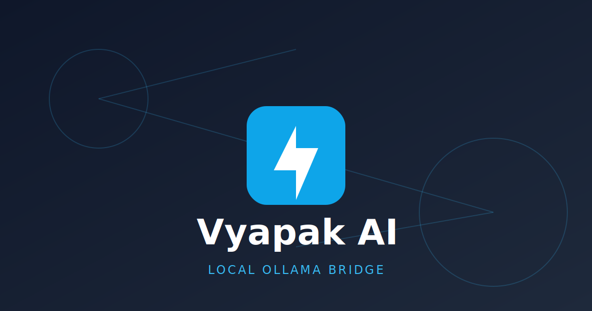

# Vyapak AI ⚡
### Modern Local Ollama Bridge & Web Interface

Vyapak AI is a high-performance, plug-and-play bridge that connects your local network to a local [Ollama](https://ollama.com/) instance. It provides a clean REST API and a modern Angular web interface to interact with your local LLMs securely.



## ✨ Features

- **🚀 Instant UI:** Modern, responsive chat interface built with Angular 19 and Tailwind CSS.
- **🔌 API Bridge:** Acts as a transparent proxy for Ollama, allowing external apps on your network to use local models without exposing the Ollama port directly.
- **📂 Persistence:** Built-in SQLite database to log and history-track your daily AI interactions.
- **🧠 Model Aware:** Automatically detects and lets you switch between all models installed on your Ollama server.
- **🛠 Developer Friendly:** Includes an integrated Developer Guide with copy-pasteable endpoint documentation.
- **🏗 Automated Build:** Single-command execution. `dotnet build` automatically compiles the Angular frontend and stages it in the API's `wwwroot`.

## 🏗 Architecture

- **Backend:** .NET 8 Web API
- **Frontend:** Angular 19 (Signals, Standalone Components)
- **Database:** Entity Framework Core + SQLite
- **Communication:** OllamaSharp
- **Styling:** Tailwind CSS

## 🚀 Getting Started

### Prerequisites

1.  **Ollama:** Ensure [Ollama](https://ollama.com/) is installed and running (`http://localhost:11434`).
2.  **Node.js:** Required for building the Angular frontend (during the .NET build process).
3.  **SDK:** .NET 8 or 9 SDK.

### Quick Start

1.  Clone the repository.
2.  Run the application:
    ```bash
    dotnet run
    ```
3.  Open your browser to `http://localhost:5045` (or the port shown in your terminal).

## 📡 API Endpoints

| Method | Endpoint | Description |
| :--- | :--- | :--- |
| `GET` | `/api/models` | Lists all models available on the local Ollama server. |
| `POST` | `/api/chat` | Sends a prompt to Ollama and saves the response. |
| `GET` | `/api/logs` | Retrieves all chat logs from the current day. |

### Sample Chat Request
```json
POST /api/chat
{
  "prompt": "Explain Quantum Computing in 3 sentences.",
  "model": "llama3"
}
```

## 🛠 Configuration

Settings can be modified in `appsettings.json`:

```json
{
  "ConnectionStrings": {
    "DefaultConnection": "Data Source=vyapak.db"
  },
  "Ollama": {
    "Host": "http://localhost:11434"
  }
}
```

## 📂 Project Structure

- `/Controllers` - API Endpoints (refactored from Minimal API).
- `/Data` - Entity Framework context and SQLite setup.
- `/Services` - OllamaSharp integration logic.
- `/ClientApp` - Angular 19 source code.
- `/wwwroot` - Compiled frontend (generated during build).

---
*Built with ❤️ for the Local AI Community.*
